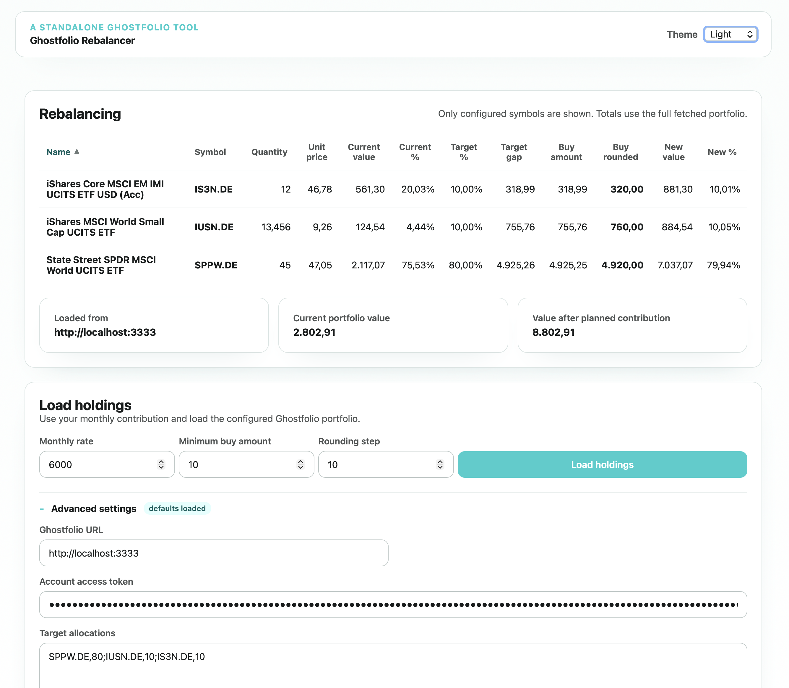

# Ghostfolio Rebalancer

Standalone Angular web app for loading holdings from a remote Ghostfolio instance
and calculating a contribution-based rebalancing plan.

<picture>
  <source media="(prefers-color-scheme: dark)" srcset="screenshot_dark.png">
  <source media="(prefers-color-scheme: light)" srcset="screenshot_light.png">
  
</picture>

## Quick Start (pre-built image)

No build step required – pull the ready-made image directly from the GitHub
Container Registry:

```bash
docker run -d -p 8080:80 \
  --name ghostfolio-balancer \
  --restart unless-stopped \
  -v "$(pwd)/data:/data" \
  -e ACCOUNT_ENCRYPTION_KEY="replace-with-a-long-secret" \
  -e BASE_URL="https://ghostfolio.example.com" \
  -e ACCESS_TOKEN="your-access-token" \
  -e ALLOCATIONS_TEXT="SPPW.DE,80|IUSN.DE,10|IS3N.DE,10" \
  ghcr.io/mini-maya/ghostfolio-rebalancer:latest
```

Then open **http://localhost:8080** in your browser.

| Environment variable | Description | Example |
|---|---|---|
| `BASE_URL` | URL of your Ghostfolio instance | `https://ghostfolio.lan` |
| `ACCESS_TOKEN` | Ghostfolio account access token | `abc123` |
| `ALLOCATIONS_TEXT` | Target allocations (`SYMBOL,PERCENT` pairs separated by `|`) | `SPPW.DE,80|IUSN.DE,10|IS3N.DE,10` |
| `ACCOUNT_ENCRYPTION_KEY` | Encryption key for stored local accounts and cached Ghostfolio bearer tokens | `replace-with-a-long-secret` |
| `ACCOUNTS_DIR` | Directory containing the encrypted account CSV file | `/data` |
| `GHOSTFOLIO_CA_CERT_PATH` | Optional path to a trusted CA certificate used for outbound Ghostfolio HTTPS requests | `/data/ca.crt` |

`BASE_URL`, `ACCESS_TOKEN`, and `ALLOCATIONS_TEXT` are optional runtime defaults and
can be changed in the UI without restarting the container. `BASE_URL` and
`ACCESS_TOKEN` only pre-fill (and auto-connect) the login form while no stored local
account exists. `ALLOCATIONS_TEXT` pre-fills the **Target allocations** field in
**Advanced settings**.

Stored local accounts are written to `ACCOUNTS_DIR/accounts.csv` as a semicolon-
separated CSV file with the required columns `user;baseUrl;allocationsText;payload`.
Only the local user name, `baseUrl`, and the plain-text per-account `allocationsText`
stay outside the encrypted payload; the Ghostfolio access token, the local password
data, and the cached Ghostfolio bearer token are encrypted with
`ACCOUNT_ENCRYPTION_KEY`.

If your Ghostfolio instance uses a private CA or self-signed certificate, place the
trusted certificate at `ACCOUNTS_DIR/ca.crt` (for the default `/data` mount this is
`./data/ca.crt`). The backend Ghostfolio client will use that CA only for outbound
Ghostfolio HTTPS requests. If you need a different filename or path, set
`GHOSTFOLIO_CA_CERT_PATH`.

When the app runs in Docker and you enter a Ghostfolio URL with `localhost` or
`127.0.0.1`, the backend automatically retries via `host.docker.internal` so a
Ghostfolio instance running on the Docker host still works.

### Docker Compose

Create a `docker-compose.yml`:

```yaml
services:
  ghostfolio-rebalancer:
    image: ghcr.io/mini-maya/ghostfolio-rebalancer:latest
    container_name: ghostfolio-balancer
    ports:
      - "8080:80"
    restart: unless-stopped
    volumes:
      - ./data:/data
    environment:
      ACCOUNT_ENCRYPTION_KEY: "replace-with-a-long-secret"
      BASE_URL: "https://ghostfolio.example.com"
      ACCESS_TOKEN: "your-access-token"
      ALLOCATIONS_TEXT: "SPPW.DE,80|IUSN.DE,10|IS3N.DE,10"
```

Then start with:

```bash
docker compose up
```

> **Note:** `BASE_URL` and `ACCESS_TOKEN` are still delivered to the browser when you
> use them as env-provided first-login defaults. Stored local accounts and cached
> Ghostfolio bearer tokens stay server-side in the mounted account directory.

---

## Local development

```bash
npm install
npm run start:server
npm start
```

Run `npm run start:server` in one terminal and `npm start` in a second terminal. The
Angular dev server proxies `/api/*` requests to the local backend on port `3000`.
Set `ACCOUNT_ENCRYPTION_KEY` before creating or using stored local accounts.

To calculate a rebalancing plan, the app needs:

1. A Ghostfolio base URL
2. An account access token
3. Optional target allocations in the format `SYMBOL,PERCENT|SYMBOL,PERCENT`

The browser calls the remote Ghostfolio instance directly, so the target instance
must allow the necessary CORS requests.

### Dialogs

**Login page dialog (`login-page`)**: The app offers two login methods side by side:

1. `baseUrl` + `accessToken` for direct Ghostfolio login
2. Local `user` + `password` for saved accounts

If `BASE_URL` and `ACCESS_TOKEN` are provided via ENV/runtime config and no stored
account exists yet, both fields are pre-filled and the app tries to connect
automatically. If you also fill in local `user` + `password`, the app first validates
Ghostfolio access and then reveals a password-confirmation field so it can create a
stored local account.

**Allocation dialog**: After loading holdings, this dialog opens when no target
allocations are configured yet. It starts with generated values from current
holdings, lets you edit each target, and only allows confirmation when the total is
exactly 100%.

## Production build

```bash
npm run build
```

## Docker (build from source)

```bash
docker build -t ghostfolio-rebalancer .
docker run --rm -p 8080:80 \
  -v "$(pwd)/data:/data" \
  -e ACCOUNT_ENCRYPTION_KEY="replace-with-a-long-secret" \
  -e BASE_URL="https://ghostfolio.lan" \
  -e ACCESS_TOKEN="your-access-token" \
  -e ALLOCATIONS_TEXT="SPPW.DE,80|IUSN.DE,10|IS3N.DE,10" \
  ghostfolio-rebalancer
```

Then open `http://localhost:8080`.

For Docker Compose:

```bash
docker compose -f docker-compose.build.yml up --build
```
```bash
docker compose -f docker-compose.dev.yml up
```

`docker-compose.build.yml` builds the image, while `docker-compose.dev.yml` only
starts an existing `ghostfolio-rebalancer:latest` image.

The checked-in `.env` file is used by default; `.env.example` is provided as a
template if you want to recreate it.

For trusted self-signed Ghostfolio certificates, copy the CA certificate into the
mounted data directory as `ca.crt` before starting the container.

The values from `BASE_URL`, `ACCESS_TOKEN`, and `ALLOCATIONS_TEXT` are optional
runtime defaults. `BASE_URL` and `ACCESS_TOKEN` are only used on the login page
until at least one stored account exists. `ALLOCATIONS_TEXT` is loaded as editable
default in **Advanced settings** for non-account sessions; stored accounts persist
their own target allocations in `accounts.csv`.

The main view directly shows **Monthly rate**, **Minimum buy amount**, **Rounding
step**, and **Load holdings**. The collapsed **Advanced settings** area contains
the editable **Target allocations** field.

`ALLOCATIONS_TEXT` and the visible text field both expect the compact format
`SYMBOL,PERCENT|SYMBOL,PERCENT`.
Without `ALLOCATIONS_TEXT`, the field starts empty and only shows the placeholder
example in the UI.

The rounding step defaults to `10.00`. Setting it to `0` disables rounding and
keeps the normalized buy amounts at exact cent precision.

Use the theme selector in the top bar to switch between System, Light, and Dark;
the chosen theme is remembered in the browser.

If you use `BASE_URL` and `ACCESS_TOKEN` as env-provided login defaults, they are
still delivered to the browser for the initial login form. Stored accounts, local
password data, and cached Ghostfolio bearer tokens stay on the server in the mounted
account directory and are encrypted with `ACCOUNT_ENCRYPTION_KEY`.
